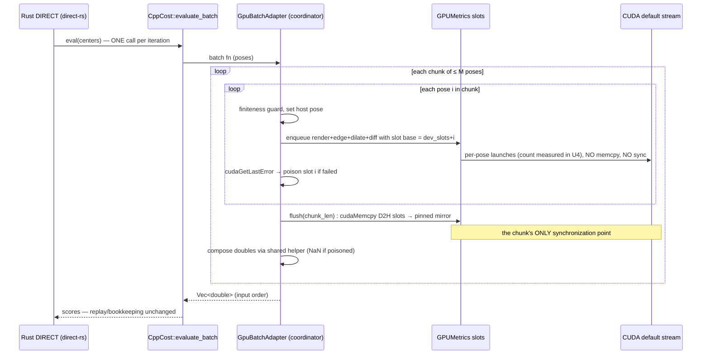

# feat: Device-resident score buffer for batched DIRECT hyperbox evaluation

## Overview

Make the GPU cost path hold the results of many hyperbox evaluations on-device in a multi-slot **score buffer**, so the host synchronizes once per DIRECT iteration (or per chunk of M poses) instead of once per pose.

Today the entire pipeline from "submit pose" to "return score" is already launch-only — every render and metric kernel is enqueued asynchronously — except one **synchronous `cudaMemcpy` of a single `int` score** at the end of `FastImplantDilationMetric` (`src/compute/fast_implant_dilation_metric.cu`, the pinned `pixel_score_` copy). That per-pose sync drains the stream, adds ~12 µs of API cost, and prevents the host from running ahead while the GPU works. We replace the single score cell with an M-slot device buffer; each enqueued evaluation writes its score into its own slot; the batch flushes once.

Crucially, **this is not concurrency**. Poses are still evaluated strictly one after another, on the same default stream, with the same shared scratch (render image, bounding box, fragment arrays). Nothing about the per-pose GPU sequence changes. What changes is where the final score lands (a slot instead of one reused cell) and when the host looks at it (once per batch instead of once per pose).

## Feasibility Verdict (the user's question, answered up front)

**Yes — this architecture is possible, and unusually cheap to land, because the host-side batch structure already exists end-to-end:**

1. The production optimizer is **Rust `direct-rs`** (`USE_RUST_DIRECT=ON`). Its loop already defers scoring: `trisect_and_return_unscored` collects **all children of the entire potentially-optimal set for the iteration**, then makes **one** `cost.eval(&centers)` call (`rust/direct-rs/src/direct_optimizer.rs`, `Cost::eval(&self, poses: &[Pose]) -> Vec<f64>`). The "list of what needs to be scored can be constructed before scoring any of them" property the user intuited is already implemented on the host side.
2. That call crosses FFI once as `CppCost::evaluate_batch(flat_poses) -> Vec<f64>` (`include/domain/cost.h`) — but today its body is a **serial loop over the single-pose adapter**, so each pose inside the "batch" still pays its own synchronous D2H + stream drain.
3. On the GPU side, only the final `pixel_score_` memcpy blocks (verified: no `cudaMemcpy`/`cudaStreamSynchronize` on the render hot path in `src/compute/render_engine.cu`; the bbox/fragment-fill D2Hs documented in `docs/jtml_cuda_d2h_hotpath_notes.org` were removed with the graph-stack cleanup; the pose reaches the GPU as kernel arguments, not a transfer).
4. Slot-indexing the score needs no kernel changes at all: `FastImplantDilationMetric_EdgeKernel_new` performs the inline reset through the `int*` pointer it is passed, and `DifferenceKernel_new` accumulates through its `int* result` parameter. Passing `dev_score_slots_ + i` at launch time is the entire GPU-side change.

The honest caveat: the gain is bounded, and the honest bound is smaller than intuition suggests. Serial wall time (~104 µs/pose on the graph-era fixture) exceeds the GPU's per-pose kernel time (~97 µs residency), so removing the per-pose D2H stream drain recovers at most the idle gap around it — stale-number arithmetic puts the ceiling at roughly **7–13% eval/s**, with `ceiling = serial_wall / measured_GPU_floor`. The per-pose launch count itself is contested (the pre-cleanup profile said ~16; the live path looks like ~9 host-visible launches plus CUB's internal kernels) and must be counted, not asserted. This plan therefore treats the ceiling as **unknown until the U4 probe measures GPU time per pose with CUDA events**, and the go/no-go gate is expressed as a fraction of the measured ceiling, never as a guessed absolute. What batching does deliver regardless: one fewer API call + stream drain per pose, the host CPU freed to run ahead during the batch's device work, and a "sync per iteration" shape that the follow-on levers (kernel fusion, double-buffered flush) compose with — fusion attacks the GPU floor itself, which this plan explicitly does not.

---

## Problem Frame

Profiling (`test/golden/probe_measurement.md`, `docs/jtml_cuda_d2h_hotpath_notes.org`) shows the DIRECT_DILATION cost path is overhead-bound, not kernel-bound: the pre-cleanup profile recorded ~16 launches and ~5 D2H copies per evaluation, total D2H payload 32 bytes, GPU busy ~1.5% in graph-era traces — the device idles because the host feeds it one pose at a time with a blocking completion point per pose. (The launch count is stale — the 2026-08-28 cleanup removed the render-path D2Hs and the PrepareLaunchPacket kernel; U4 re-measures the real per-pose count and GPU time before any conclusion.) The CUDA-graph batching approach to this same problem was measured and reverted (`test/golden/graph_performance_baseline.json`: `verdict: reverted`, benefit 0.154×). The user explicitly wants the simpler architecture: same serial per-pose execution, one device-side multi-slot score buffer, one memcpy back per batch.

---

## Requirements Trace

- R1. A device-resident score buffer holds ≥ M (default 256) independent evaluation results; each enqueued pose evaluation writes its final score into its own slot without host intervention.
- R2. The monoplane DIRECT_DILATION batch path performs exactly **one** D2H synchronization per chunk of ≤ M evaluations (and one per iteration when the iteration's child count ≤ M).
- R3. Batched scores are **bit-identical** to the current serial-loop scores for the same pose list in the same order (same kernels, same arithmetic, same composition).
- R4. The Rust `direct-rs` crate and the CXX bridge signatures do not change; the optimization is invisible to the FFI contract (`evaluate_batch` input/output order and shape preserved).
- R5. All configurations outside the gate (biplane, DistanceMap enabled, non-DIRECT_DILATION cost functions, buffer allocation failure) fall back to today's exact serial loop.
- R6. A GPU measurement probe proves (a) R3 bitwise equality and (b) throughput improvement measured against a probe-derived per-pose GPU floor ("the ceiling"), and a documented ceiling-relative go/no-go gate decides whether the batch path becomes the production default.
- R7. Cooperative stop/cancel latency and GUI update cadence are unchanged relative to today (flush granularity is already the iteration boundary).

---

## Scope Boundaries

- **Monoplane `DIRECT_DILATION` with `DistanceMapMetric` disabled** (its current state in `src/compute/DIRECT_DILATION.cpp`) is the only batched configuration in v1.
- No CUDA graphs, no multi-stream concurrency, no per-pose workspace banks, no `EvaluationExecutor`-style abstraction (explicitly banned by the hot-path notes' "what not to prioritize" list and the plan 011–013 postmortem).
- No change to the DIRECT algorithm, budget accounting, or the Rust optimizer.
- Kernel-count reduction (reset collapse, Difference+DistanceMap fusion, simpler rasterizer) is **not** part of this plan — it stays in `docs/jtml_cuda_d2h_hotpath_notes.org` and composes with this work later.
- Re-enabling `DistanceMapMetric` is a follow-on that consumes the slot extension point (see Future Considerations).
- The dead `#else` (USE_RUST_DIRECT=OFF) branch in `src/coordinator/optimizer_manager.cpp` still references removed graph-era symbols (`BankState`, `capacity_service_`, `evaluation_executor_`); it does not compile. Repairing or excising that branch is **out of scope** (recorded under Risks); this plan works entirely in the live `#if USE_RUST_DIRECT` branch.
- Old graph-era files under `test/oracle/` are stale and are neither repaired nor extended; this plan adds only new, purpose-built test files.

---

## Context & Research

### Relevant Code and Patterns

- `src/coordinator/optimizer_manager.cpp` — `RunDirectStage` (live branch: `CppCost cost(serial_cost)` → `run_rust_opt`), `jta::BuildGpuCostAdapter` (set pose → `callActiveCostFunction`).
- `include/domain/cost.h` — `CppCost` with `evaluate()` and the already-present serial-loop `evaluate_batch()`; this is the seam the batch implementation replaces.
- `rust/direct-rs/src/cost.rs`, `rust/direct-rs/src/direct_optimizer.rs`, `rust/direct-rs/src/lib.rs` — batch-native `Cost` trait; one `eval` call per iteration; NaN→INFINITY treatment in replay (`sort_cost`). **No edits.**
- `src/compute/fast_implant_dilation_metric.cu` — `EdgeKernel_new` (inline reset through `int*`, fixed-grid, device-bbox), `DilateKernel_new`, `DifferenceKernel_new` (atomic accumulate through `int* result`, device-derived crop), and `GPUMetrics::FastImplantDilationMetric` holding the last per-pose `cudaMemcpy`.
- `src/compute/gpu_metrics.cu` — `GPUMetrics` constructor owns all pinned mirrors (`cudaHostAlloc`) and device scalars; destructor frees them. The score-buffer allocation follows this exact pattern.
- `src/compute/DIRECT_DILATION.cpp` — `costFunctionDIRECT_DILATION`: render + `white_pix_sum + FastImplantDilationMetric(...)` composition (host-side); the composition must be factored into a shared helper used by both serial and batch paths (bit-identity by construction).
- `include/compute/CostFunctionManager.h` — stage init/destruct hooks (`initializeDIRECT_DILATION` computes the per-stage white-pixel constant and dilation parameter — both are batch-invariant).
- `src/domain/cost.cpp` + layering: the pure chunk-plan/compose logic belongs in `jtml_domain` (Qt/GPU-free) so it is headless-testable and Rust-interop-safe per the 003 layered layout.

### Institutional Learnings

- `test/golden/probe_measurement.md` — cudaGraphLaunch 29.41 µs, cudaMemcpy D2H-pinned 12.14 µs, cudaLaunchKernel 3.66 µs; graph host floor ~73 µs/pose; "reduce pinned D2H per pose, or move host work off the critical path" named as the deferred lever this plan takes up.
- `test/golden/graph_performance_baseline.json` — graph batch was 5.7× slower than serial; the failure was the graph API host cost, **not** the per-iteration batching structure. Batching itself remains sound.
- `docs/jtml_cuda_d2h_hotpath_notes.org` — "no host-visible intermediate state between submit pose and return scalar" is the desired invariant; recommendations 1–2 (device bbox / fragment fill) are already done in the live `_new` render path; recommendation 3 (single result D2H) generalizes to this plan's slot buffer.
- Layered correctness (bit-exact renderer output → raw-int reductions → composed double): final-score bit-identity alone can hide raw-int divergence; this validation shape was captured in a graph-era solution doc since removed in the 2026-08-28 docs sync (recoverable via `jj` history) — the surviving two-tier contract lives in `golden_oracle.org`.
- `docs/solutions/logic-errors/jtml-cuda-graph-stub-failure-2026-08-19.md` — graph-era units passed circular self-tests as "done"; the probe here must compare against the **production serial path**, not a sibling of the new code.
- `docs/rust-direct-rs-ffi-handshake.org` / `docs/rust-direct-rs-ffi-seam-todos.org` — planned shape `Cost::eval(&[Pose]) -> Vec<f64>` is already live in code; batch overshoot-by-one-batch semantics predate this plan and are unchanged by it.

---

## Key Technical Decisions

- **Slot = one `int` (the dilation score), not a struct (v1)**: the only live per-pose result today. Device slots are a contiguous `int[M]` with a pinned mirror `int[M]`; flush copies `used * sizeof(int)`. The `DirectDilationResult` 3-int record from the hot-path notes becomes the extension point when DistanceMap returns — not needed for the gate measurement, and 4 bytes keeps the false-sharing/occupancy question for another day.
- **Pointer-offset slotting, zero kernel edits**: kernels already receive their score pointer; the batch layer launches the identical kernels with `dev_score_slots_ + slot`. The Edge kernel's inline reset hits slot i because it writes through the same pointer. Risk surface collapses accordingly.
- **Default legacy stream only; strictly serial enqueue order**: render(i) → edge(i) → dilate(i) → diff(i) → render(i+1) → … on one stream. This preserves the scratch-reuse discipline that makes each pose's computation identical to today's. A comment + debug-build assertion documents "batch path must not introduce side streams."
- **Flush = end of chunk; chunk ≤ M; one `cudaMemcpy` per chunk**: the host cannot continue DIRECT's next iteration without the scores, so "buffer full" and "batch done" are the same event in practice. Iterations larger than M (trunk-level hulls can reach hundreds of children) are processed as consecutive full chunks; the last chunk is partial. No double-buffering overlap in v1 (future consideration).
- **Host-side composition stays, factored into a shared helper**: the existing serial composition (`white_pix_sum + metric_return`, where `metric_return = -1.0 * pixel_score_int` inside `FastImplantDilationMetric`) is moved — not re-derived — into one domain-level pure function called by both serial and batch paths, preserving the expression's structure as well as its arithmetic. This is the strongest available bit-identity guarantee (R3) and kills the analyzer's M3 duplication risk.
- **Error policy: two error classes, two mechanisms + sticky-state abort**: LAUNCH-time errors (invalid configuration, launch out of resources) are recorded synchronously by the failing host call — a per-pose `cudaGetLastError()` probe immediately after pose i's metric group catches these and poisons that slot only. EXECUTION errors (illegal address, device assert) are asynchronous: they surface at the next host-visible sync point — here the chunk flush's `cudaMemcpy` returns error — handled by the standing "flush failure poisons the whole chunk" policy. The bare `cudaGetLastError()` reset at the top of `Render()` (`src/compute/render_engine.cu`) makes the attribution window explicit: the probe must fire between pose i's last launch and pose i+1's render — so the per-pose enqueue+probe is encapsulated as ONE indivisible helper step; splitting render and metric phases across loops would silently swallow launch errors. Poisoned slots compose to NaN (matching the existing Rust `sort_cost` NaN→INFINITY degradation); never re-run a pose. Multi-chunk cascading: after the FIRST flush failure the device error state is sticky — stop enqueuing remaining chunks and poison their slots directly (further launches are wasted work), still returning a full-length result vector. Non-finite input poses skip enqueue and get NaN directly (cheap guard against garbage-bbox OOB). Probe cost is negligible (~0.3 µs non-syncing per pose; ~60 µs per 200-pose chunk — noise against the saving), confirmed by the perf review.
- **Buffer lives in `GPUMetrics`**, allocated next to the existing singletons/pinned mirrors; `initialized_correctly_` flips false on allocation failure, and the coordinator gate (below) independently falls back to serial if the batch API reports unavailable. `CppCost` stays a dumb handle with an optional bound batch function.
- **Wiring = bind a batch function into `CppCost`** (new optional `std::function` member consulted by `evaluate_batch`; falls back to the current loop when unset): keeps the FFI signature stable (R4), keeps `cost.h` Qt/GPU-free (the function is produced coordinator-side, exactly like `BuildGpuCostAdapter` today), and preserves the non-Rust/C++ path and all other stages unchanged (R5).
- **Gate conditions evaluated in the coordinator**: batch adapter is installed only when `!biplane_calibration && active cost == "DIRECT_DILATION" && batch API available`. Any other configuration keeps the exact current code path (R5).

---

## Open Questions

### Resolved During Planning

- Where does the batch injection point live? → `CppCost::evaluate_batch` (already production-routed by Rust `Cost::eval` per-iteration); no Rust or FFI-signature changes.
- Does batching change DIRECT semantics? → No: same values, same order, same iteration boundaries; budget overshoot-by-one-batch semantics are identical to today's serial-loop batch call.
- What remains that syncs per pose? → Only the score memcpy (render-path D2Hs and pose H2D do not exist in live code; verified against `render_engine.cu` and `gpu_model.cu`).
- Slot layout? → `int[M]` now, `DirectDilationResult` records as the DistanceMap-era extension.
- Who zeroes a slot? → The Edge kernel's existing inline reset, via the slot pointer; zero-area bboxes are safe because the reset precedes the tile loop.
- Expected win? → ceiling = `serial_wall / measured_GPU_floor` per pose; historical numbers imply ~7–13%, but the absolute estimate is untrusted — the U4 probe measures GPU time per pose (CUDA events) and counts real launches before the gate fires. The gate is ceiling-relative.

### Deferred to Implementation

- Exact M (buffer capacity) tuning: 256 default; confirm typical/maximum per-iteration child counts from one logged trunk run before fixing the constant.
- Whether `cudaGetLastError()` per pose shows measurable cost at full enqueue rate (expected negligible; measure in the probe; if not, collapse to per-chunk check + poisoned-tail semantics).
- Final symbol names for the enqueue/flush API and the batch adapter factory.
- Whether the probe executable joins `test/CMakeLists.txt` under `oracle;gpu` labels or lives as a manual benchmark tool under `test/probe/` — decide when touching the build (graph-era registration patterns are stale; do not resurrect them).

---

## High-Level Technical Design

> *This illustrates the intended approach and is directional guidance for review, not implementation specification. The implementing agent should treat it as context, not code to reproduce.*

Slot lifecycle per pose: `free → (enqueue) claimed-and-reset-by-edge → (diff) atomic-filled → flushed → consumed/released`. A launch failure between claimed and filled leaves stale content — detected by the per-pose error probe and overwritten by NaN at compose time; a stale slot is never readable as a score.

Serial path (today) becomes expressible as "batch of size 1 + immediate flush", but is kept as its own entry point so untouched code stays untouched.

---

## Implementation Units

### Phase A — GPU-side machinery

- [ ] U1. **Score slot buffer + enqueue/flush API in `GPUMetrics`**

**Goal:** The device can accumulate many independent dilation scores into indexed slots and hand them back in one bulk D2H.

**Requirements:** R1, R2, R3

**Dependencies:** None

**Files:**
- Modify: `include/compute/gpu_metrics.cuh`
- Modify: `src/compute/gpu_metrics.cu`
- Modify: `src/compute/fast_implant_dilation_metric.cu`
- Test: `test/unit/test_score_slot_buffer.cpp` (new, Catch2, GPU-touching headless seam if it can init a device — else `oracle` label; follow existing CUDA ownership test conventions in `test/unit/`)

**Approach:**
- Add `dev_score_slots_` (`int[M]`, device) + `score_slots_pinned_` (`int[M]`, `cudaHostAlloc`) allocated beside the existing `dev_pixel_score_`/`pixel_score_` pair; free in destructor alongside them. M = 256 constant (deferred tuning noted in Open Questions).
- Add a slot enqueue API that launches the existing `FastImplantDilationMetric_EdgeKernel_new` / `_DilateKernel_new` / `_DifferenceKernel_new` with the score pointer replaced by `dev_score_slots_ + slot`, mirroring the body of the current `FastImplantDilationMetric` exactly (same fixed grids `edge_grid_`, `dilate_grid_`, `difference_grid_`; same arguments; no kernel-source edits).
- Add a flush API: single blocking `cudaMemcpy` D2H of `count` ints into the pinned mirror; returns `cudaError_t`. A plain blocking copy is deliberate on the legacy stream: implicit ordering gives one API call and the chunk's one sync; `cudaMemcpyAsync` variants add a second call and buy no overlap in v1. Document and debug-guard that the mirror is `cudaHostAlloc`-pinned — a pageable mirror silently degrades to a staged copy now and breaks loudly the day someone switches to the Async variant.
- Expose a `ScoreSlotsAvailable()` predicate (allocation succeeded).
- Leave the legacy single-score `FastImplantDilationMetric` untouched for now (serial fallback keeps using it).

**Execution note:** Keep this unit purely additive; no production call sites change yet.

**Patterns to follow:**
- Pinned/device allocation pairing and `initialized_correctly_` error handling in the `GPUMetrics` constructor.
- Fixed-grid launch config usage already established for the `_new` kernels.

**Test scenarios:**
- Happy path: enqueue evaluations for slots 0 and 1 with two distinct synthetic images → flush → each pinned slot holds its own score, equal to what the legacy single-score path produces for the same inputs.
- Happy path: enqueue into slot k > 0 leaves slots ≠ k unchanged from a known sentinel pattern (slot isolation).
- Edge case: flush(count=0) is a no-op returning success; flush(count=M) copies the full buffer.
- Edge case: M-slot wrap: enqueue M poses, flush; then a second batch of count=2 overwrites only slots 0–1 after re-enqueue (no stale-slot leakage into reported values — verified via sentinel pre-fill).
- Error path: allocation failure simulation (or unit testing the availability predicate) → `ScoreSlotsAvailable()` false and legacy path still functional.
- Integration: the inline Edge reset zeroes slot i before Difference atomics arrive, i.e. two back-to-back enqueues to the same slot with the flush after both yields the sum-free second value, not an accumulation (resets actually fire).

**Verification:**
- A headless/CUDA test round-trips two known poses through the slot API and observes both expected ints after one flush.

---

- [ ] U2. **Batch enqueue entry + shared compose in the cost-function layer**

**Goal:** One DIRECT_DILATION pose evaluation can be enqueued into a slot (no sync), and the serial/batch double-score composition lives in exactly one pure place.

**Requirements:** R3, R5

**Dependencies:** U1

**Files:**
- Modify: `include/compute/CostFunctionManager.h`
- Create: `include/domain/score_composition.h`
- Create: `src/domain/score_composition.cpp` (remember: explicit `.cpp` list in `src/domain/CMakeLists.txt` — GLOB catches headers only)
- Modify: `src/compute/DIRECT_DILATION.cpp` (add the enqueue-only slot variant + rewire `costFunctionDIRECT_DILATION` to call the shared compose helper — value-preserving)
- Test: `test/unit/test_score_composition.cpp` (Catch2) and `test/unit/test_score_composition_properties.cpp` (hegel PBT per `test/HEGEL-PBT-GUIDE.md`)

**Approach:**
- Extract the per-pose body of `costFunctionDIRECT_DILATION` (render primary + metric enqueue) into an enqueue-only variant that takes a target slot and uses the U1 slot API; the existing synchronous entry remains.
- Extract the host composition into a domain pure function (e.g. `ComposeDirectDilationScore(int score, int white_pix_sum) -> double`, plus a poisoned-slot NaN variant). Mind where the negation lives today: `FastImplantDilationMetric` returns `-1.0 * pixel_score_[0]` and the serial entry adds the white-pixel constant — the helper must mirror that exact structure (the expression moved, not re-derived), and both the serial entry and the batch flush path call it. This is the bit-identity backbone.
- The enqueue variant asserts the stage-init invariants (white-pix constant, dilation parameter already cached in `CostFunctionManager` by `initializeDIRECT_DILATION`) rather than recomputing them.
- Gate: if the stage's per-frame white-pix state or active cost function is not what the batch adapter expects, report unavailable (the coordinator decides).

**Patterns to follow:**
- Existing `CostFunctionManager` initialize/destruct/cost triple structure.
- Domain-purity layering (`jtml_domain` is Qt/GPU-free; keeps the compose helper unit-testable and Rust-bridge-safe).

**Test scenarios:**
- Happy path (headless compose): composed doubles from known (score, white_pix) pairs match literal values captured from the current serial path before refactor (characterization values hardcoded from a pre-refactor run).
- Happy path: `costFunctionDIRECT_DILATION` post-refactor returns identical doubles to pre-refactor on the production pose probe sequence (Tier-2 oracle-style check on a GPU machine; the existing golden frames `test/golden/fem_golden.jts` fixture family is the reference input, not a test dependency on stale graph-era tests).
- Edge case: poisoned-slot variant returns NaN; compose helper is pure and side-effect-free (PBT: deterministic, order-independent over a random vector of slot ints).
- Edge case: negative and zero dilation scores compose exactly (metric can be negative before the white-pix constant).
- Integration: enqueue-then-flush of one pose equals the synchronous `FastImplantDilationMetric` value on the same image (bridges U1 slot path and the legacy path).

**Execution note:** Capture current serial-path scores **before** rewiring the compose call (characterization-first), then refactor and re-diff.

**Verification:**
- Grep confirms exactly one definition of the composition arithmetic; both paths call it; headless compose tests green under `pixi run test`.

---

### Phase B — batch wiring (host side)

- [ ] U3. **Gpu batch cost adapter + `CppCost` binding**

**Goal:** `evaluate_batch` routes to a true device-batched evaluation with chunked flush when the gate passes; everything else keeps the current behavior byte-for-byte.

**Requirements:** R1, R2, R4, R5, R7

**Dependencies:** U2

**Files:**
- Create: `include/domain/batch_planner.h` / `src/domain/batch_planner.cpp` (pure chunk planning: pose count N, capacity M → chunk ranges; explicit source-list registration in `src/domain/CMakeLists.txt`)
- Test: `test/unit/test_batch_planner.cpp` (+ hegel properties file mirroring U2's pattern)
- Modify: `include/domain/cost.h` (`CppCost`: optional bound batch `std::function<std::vector<double>(const std::vector<Point6D>&)>`; `evaluate_batch` consults it, else current loop; unbound-poison → NaN preserved)
- Modify: `include/coordinator/optimizer_manager.h` / `src/coordinator/optimizer_manager.cpp` (`BuildGpuBatchCostAdapter` next to `BuildGpuCostAdapter`; gate checks; bind into the `CppCost` built by `RunDirectStage`)

**Approach:**
- The adapter lambda: for each chunk (via `BatchPlanner`), for each pose: finiteness-check (non-finite → poison, skip enqueue), `SetCurrentPrimaryCameraPose` (host-only), then the indivisible enqueue-pose-to-slot step (render+metric launches followed by the `cudaGetLastError` probe — never split render and metric phases across separate loops, which would break the error-attribution window); flush chunk once; on flush failure, stop enqueueing further chunks and poison their slots (device error state is sticky); compose doubles per slot through the shared helper (poisoned → NaN); append in input order.
- `BatchPlanner` is pure/CUDA-free so chunk-boundary logic (last-partial, N=0, N>M, N==M) is headless-testable.
- Gate in `RunDirectStage`: `!calibration_.biplane_calibration && stage_manager.getActiveCostFunction() == "DIRECT_DILATION" && gpu_metrics batch slots available` → bind batch fn; otherwise bind nothing (current serial loop remains the body of `evaluate_batch`).
- Install the batch path **behind a flag** (runtime env or a constexpr in the coordinator) defaulting ON only after U4's gate passes; this preserves an A/B switch for the probe itself (unit U4 needs both arms in one build).
- Frame/stage transitions: the adapter's captured stage-manager reference is per-`RunDirectStage` (same lifetime contract as today's adapter).

**Patterns to follow:**
- `BuildGpuCostAdapter` (by-value calibration capture, pose construction from `Point6D`).
- Existing NaN semantics for non-finite/unbound cost (don't invent new error channels).
- `test_direct_optimizer_batch.cpp`'s input-order-preservation discipline as a spec for what "ordered scores" means.

**Test scenarios:**
- Happy path (headless planner): N=0, N=1, N=M-1, N=M, N=M+1, N=2M, N=2M+1 chunkings produce the expected ranges and sizes; concatenated results align to input order.
- Happy path (GPU, oracle label): batch adapter over the production 9-pose probe sequence returns scores bitwise equal to the unbound serial loop on the same sequence (this is R3's regression lock).
- Error path: pose with a NaN coordinate → NaN in result at that index, correct values elsewhere, no GPU work enqueued for it, run continues.
- Error path: injected/observed launch failure for a mid-chunk pose (e.g., deliberately bogus grid via test-only hook, or fault via an extreme off-frame pose if it errors rather than NaNs) → that index NaN, other slots valid, single flush still one memcpy.
- Integration (FFI shape): through `CppCost::evaluate_batch` exactly as Rust calls it — flat `Vec<f64>` of length 6N in, length N out, order-aligned; empty batch → empty result.
- Integration (Rust, headless): with the GPU batch fn mocked as a pure function, `direct-rs` test suite still converges on the analytic cost (guards against accidental FFI contract drift; run via existing `cargo test` wiring, no new harness).
- Edge case: batch function bound and gate later becomes false (frame change to biplane?) — adapter is per-stage so gate is evaluated once per stage; document that mid-stage config change is impossible today.

**Verification:**
- Same-pose-list equality probe passes bitwise; `pixi run test` green; a manual app run of a monoplane stage produces identical final pose to today's build at the printed eval count.

---

- [ ] U4. **Equivalence + throughput probe and go/no-go gate**

**Goal:** Empirically decide whether the device score buffer becomes the production path — with numbers, per the graph-executor postmortem discipline.

**Requirements:** R6

**Dependencies:** U3

**Files:**
- Create: `test/probe/score_batch_probe.cpp` (or `.cu`; a standalone Catch2/GPU tool driving BOTH arms through the same `CppCost` — flag-bound batch vs plain serial loop — over fixed and logged pose sets; registered under `oracle;gpu` labels only if the build stays clean, else documented as manual-only given stale graph-era test CMake churn)
- Create: `test/golden/score_batch_measurement.md` (results record: eval/s serial vs batch, p50/p99 per-chunk wall, D2H count/eval, launches/eval, bitwise-equality verdicts, host/CPU enqueue rate)
- Modify: `docs/jtml_cuda_d2h_hotpath_notes.org` (working checklist: mark the "one D2H per batch" outcome and cross-link)

**Approach:**
- **Pre-gate step (before any timing conclusion):** measure per-pose GPU kernel time for the CURRENT serial path via CUDA event pairs bracketing its kernel group, and count real kernel launches per pose from the probe's nsys pass (CUB's internal launches included; the old "~16" and a cursory "~9" are both untrusted). Compute `ceiling = serial_wall_per_pose / measured_GPU_floor_per_pose` — the best any batch of this shape can do, since batching cannot shorten GPU execution.
- Arms: (a) batch unbound (current serial loop), (b) batch bound — same binary, same fixture poses; measure unprofiled eval/s + a short nsys pass (API-call counts per pose, memcpy time) on the RTX 3090 Ti fixture used by prior measurements.
- Inputs: production 9-pose sequence, a ~200-pose randomized-on-lattice set (includes near-degenerate poses: fully off-frame, huge bbox, zero-overlap), and one real trunk-run child log (record per-iteration child counts → confirms M=256 headroom, feeds the deferred capacity question).
- Gate table (write into the measurement doc BEFORE running, with the measured ceiling substituted — graph-pre-registration discipline, ceiling-relative so it cannot be unreachable by construction):
  - Bitwise mismatch anywhere → **blocking bug**; fix before any timing conclusions.
  - ≥ 70% of measured ceiling → adopt: default the flag ON (U5).
  - 30–70% of measured ceiling → keep behind flag; reprioritize kernel-fusion work in the hot-path notes as the next plan (GPU floor confirmed as the binding constraint — fusion is the lever that lowers it).
  - < 30% of measured ceiling → premise falsified at this stage; stop; record findings; revert to U3-only state (flag default off) and write the postmortem section.
- Secondary measurements that make the verdict audit-proof: per-pose GPU time (events) both arms; CPU-side `cudaLaunchKernel` total time around the enqueue block; GPU busy % (GPU/wall) both arms; gap ratio (wall − enqueue − GPU)/wall; flush payload bytes + flush API wall time (with the PCIe-wire arithmetic: a 1 KB payload is <0.1 µs on Gen3/Gen4 — proving the ~12 µs figure is API/driver overhead, not bandwidth, and the ~12 µs-per-pose vs ~12 µs-per-chunk asymmetry IS the value proposition); `cudaGetLastError` probe cost per chunk; per-iteration child-count histogram; actual kernel count per pose.

**Patterns to follow:**
- `test/golden/probe_measurement.md` format; `graph_performance_baseline.json` pre-registered-gate discipline (but no graph code).
- Anti-stub rule from `docs/solutions/logic-errors/jtml-cuda-graph-stub-failure-2026-08-19.md`: both arms measured in the same process against the production adapter.

**Test scenarios:**
- Test expectation: none — U4 is the measurement gate itself; its artifact is the markdown record, not assertions. (Bit-equality assertions live inside the probe as hard failure conditions, and in U3's regression tests.)

**Verification:**
- `test/golden/score_batch_measurement.md` contains: pre-registered gate, both arms' numbers, per-iteration child-count histogram, and the recorded decision; the decision matches the gate table.

---

- [ ] U5. **Default-on, docs, and AGENTS sync**

**Goal:** If the gate passes: batch path is the production default for the monoplane DIRECT_DILATION stage, and the repo's living docs reflect the new invariant.

**Requirements:** R2, R6

**Dependencies:** U4 (gate: adopt)

**Files:**
- Modify: `src/coordinator/optimizer_manager.cpp` (flag default)
- Modify: `AGENTS.md` ("Current work" section)
- Modify: `docs/jtml_cuda_d2h_hotpath_notes.org` (status markers)
- Modify: `docs/solutions/` (new documented-solution entry: score-buffer batching result + numbers, so the graph-era learning chain stays unbroken)

**Test expectation:** none — configuration/docs change; behavior covered by U3/U4.

**Verification:**
- Fresh app run: trunk stage uses batch path (log line), final poses match golden Tier-2 expectations; eval/s from U4 reproduced.

---

### Phase C — hygiene (independent)

- [ ] U6. **Remove orphaned graph-era seam declarations from the compute headers**

**Goal:** Delete dead declarations that no longer have implementations — the `cudaStream_t` overload declarations in `include/compute/gpu_metrics.cuh` (`FastImplantDilationMetric(..., cudaStream_t)`, `EnqueueDistanceMapMetric`, `CompleteDistanceMapMetric`, the stream wrapper overload) and the stale `SetActiveBank`/bank-comment block — which today read as if an async seam exists and would mislead the next reader (and the next batch implementation).

**Requirements:** R5 (clarity of the fallback surface)

**Dependencies:** None (safe to do alongside U1; check each symbol has no in-tree definitions first)

**Files:**
- Modify: `include/compute/gpu_metrics.cuh`
- Modify: `include/compute/CostFunctionManager.h` (if bank-era declarations linger there)

**Test expectation:** none — declaration deletion; build is the test.

**Verification:**
- `pixi run build` links clean; grep for the removed symbols returns nothing in `src/`/`include/`.

---

## System-Wide Impact

- **Interaction graph:** Only `RunDirectStage`'s live `#if USE_RUST_DIRECT` branch changes. Rust `direct-rs`, the CXX bridge, `callActiveCostFunction` consumers (GUI display passes, Mahfouz/other stages, DRR rendering paths) see no contract change. The serial single-pose adapter remains intact for the biplane/T1/SAME_Z/pole-constraint stages and the Tier-2 oracle path.
- **Error propagation:** Poisoned-slot NaN flows into the existing Rust `sort_cost` non-finite handling (→ INFINITY, box dropped from selection) — an already-live path, not a new channel. CUDA errors never cross FFI as exceptions (matches the panic-firewall posture in the Rust seam todos).
- **State lifecycle risks:** Slot staleness on mid-chunk launch failure is the single new hazard; addressed by per-pose error probe + poison flag. Stale `#else`-branch rot (`BankState` etc.) remains a compile hazard only for flag-off builds — unchanged by this plan, surfaced under Scope Boundaries.
- **API surface parity:** `CppCost::evaluate` (single) is untouched; `evaluate_batch` gains behavior but keeps its signature/order/length contract. The future Rust-side `CppCost` binding work in `docs/rust-direct-rs-ffi-seam-todos.org` inherits the batch fn for free.
- **Integration coverage:** Cross-layer (FFI→coordinator→compute→stream) correctness is what U3's integration scenarios and U4's probe prove; headless units cannot. Keep them in the plan's verification, not optional.
- **GUI/cooperative stop:** Unchanged cadence — flush already coincides with the iteration boundary where `Stop()`/display updates happen today; biplane stages unaffected.
- **Unchanged invariants:** DIRECT box bookkeeping, cumulative budget (20k/25k/30k), per-stage init/teardown, Tier-2 oracle semantics (`golden_oracle.org`: appearance-based IoU > 0.85 on Kneel_1), and the single-pose evaluation order all explicitly unchanged; batched scores are equal, not merely close.

---

## Risks & Dependencies

| Risk | Mitigation |
|------|------------|
| The ceiling itself is small: GPU per-pose kernel time may be the binding floor (~7–13% headroom by stale-number arithmetic), so even a perfect batch can land modest | Pre-gate measures the real ceiling (events + launch census) and the gate is ceiling-relative (adopt ≥70% of it); the flag-only branch keeps the machinery cheap to carry; hot-path-notes fusion work attacks the GPU floor directly and is the natural next plan either way |
| Stale slot read mistaken for a score after a mid-chunk failure | Per-pose error probe + poison flag; poisoned slots never flush-validated; NaN at compose |
| Hidden sync inside render/metric path that the walk missed (e.g. CUB internals, error checks) | U4's nsys pass counts D2Hs/API calls per pose — measurement will expose any residual sync directly; the claim is checked, not assumed |
| Batching a real trunk iteration of hundreds of children thrashes L2 / changes timing variance | Fixed-grid kernels already keep working sets per-pose; chunk size M caps in-flight work; probe uses realistic child counts |
| Graph-era header symbols (U6) still referenced by orphan `test/oracle` builds | U6 verifies no `src/`/`include/` definitions exist; stale oracle test files stay unregistered and are not extended (per AGENTS: never in headless default) |
| Dead `#else` branch in `optimizer_manager.cpp` bit-rots further during this work | Plan touches only the `#if USE_RUST_DIRECT` region; record as follow-up cleanup, out of scope here |
| Double-buffering temptation mid-implementation ("overlap flush with next chunk") | Explicitly deferred (Future Considerations); v1's sync-at-flush is the whole point of simplicity; revisit only after U4 numbers |

---

## Documentation / Operational Notes

- U5 updates `AGENTS.md` "Current work" so the next session knows the batch path exists and what replaced the single D2H.
- The hot-path notes checklist gains "one D2H per batch (M slots)" as its own completed recommendation.
- A `docs/solutions/performance-issues/` entry after U4 (the directory is currently empty — this is also the first formal perf learning, as the learnings research recommended).

---

## Future Considerations (deliberately not v1)

- DistanceMap re-enablement: extend slot to the `DirectDilationResult` record and add its two accumulators as slot fields (the notes' recommendation 3 + fusion recommendation 5 compose with this exactly).
- Biplane batching: both cameras' metrics into per-pose slot pairs with the square-composition on-device or at compose time.
- Double-buffered chunk overlap (cudaMemcpyAsync + events between chunk flush and next chunk enqueue) — the natural next step **if** U4 shows the host is no longer the floor.
- Device-side composition (score doubles straight into the buffer, white-pix constants uploaded once) — only if composition ever moves on-device wholesale; today's host compose is free.
- Repairing/excising the dead `USE_RUST_DIRECT=OFF` branch (separate cleanup change).

---

## Success Metrics

- Bitwise equality of batched vs serial scores on all probe pose sets (R3) — binary pass/fail.
- eval/s improvement on the monoplane trunk stream meeting the ceiling-relative U4 gate table (R6), with the ceiling itself (event-measured GPU floor) recorded.
- One D2H call per ≤ 256 evaluations on the batch path, confirmed by API counts (R2).
- Zero diffs in `rust/` and no changes to `evaluate_batch`'s external contract (R4).
- A completed measurement record in `test/golden/score_batch_measurement.md` with a decision that a reviewer can re-audit against the gate.

---

## Sources & References

- Related code: `src/compute/fast_implant_dilation_metric.cu`, `src/compute/DIRECT_DILATION.cpp`, `include/domain/cost.h`, `src/coordinator/optimizer_manager.cpp`, `rust/direct-rs/src/direct_optimizer.rs`
- Prior art (same problem, rejected approach): `docs/plans/2026-08-19-011-feat-cuda-graph-greedy-evaluation-executor-plan.md`, `docs/plans/2026-08-20-012-*`, `docs/plans/2026-08-20-013-*`, `test/golden/graph_performance_baseline.json`
- Measurements: `test/golden/probe_measurement.md`
- Design notes: `docs/jtml_cuda_d2h_hotpath_notes.org`, `golden_oracle.org`, `docs/rust-direct-rs-ffi-handshake.org`, `docs/rust-direct-rs-ffi-seam-todos.org`
- Institutional learnings: `docs/solutions/logic-errors/jtml-cuda-graph-stub-failure-2026-08-19.md`; `docs/solutions/architecture-patterns/jtml-three-layer-optimizer-architecture.md` (adapter → CppCost → Rust seam). The graph-era tiered-correctness and feeder-hotspin solution docs were removed in the 2026-08-28 docs sync — their lessons are preserved in this plan's Context & Research and in `jj` history.
